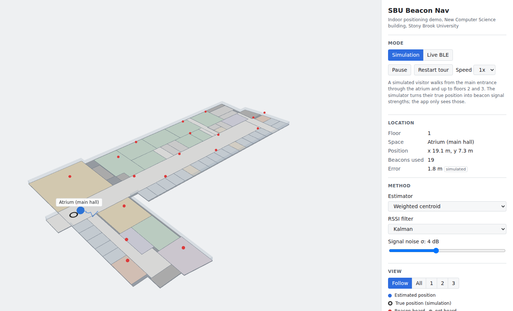

# SBU Beacon Nav

A web demo of BLE-beacon indoor positioning in Stony Brook University's New Computer Science (NCS) building,
rendered in 3D. Built for the VIP295 "Tech Businesses in Development" team.



## What it does

- Shows the three NCS floors, traced from the official 2015 floor plans, with the atrium openings cut out of the slabs.
- **Simulation mode** (any device): a simulated visitor walks from the main entrance through the atrium and up to
  floors 2 and 3. A radio model turns the true position into beacon signal strengths (RSSI); the positioning engine
  sees only those, and the app shows the estimated floor, space and position next to the true one.
- **Live BLE mode** (Chrome on Android or macOS with `chrome://flags/#enable-experimental-web-platform-features`):
  scans for Eddystone-UID beacons via Web Bluetooth. iOS browsers cannot scan for BLE at all; the panel explains why
  when the browser lacks support.
- Everything runs in the browser. There is no backend and no location data leaves the page.

## Accuracy (simulated)

From `npm run bench`, walking tour, noise σ = 4 dB, Kalman-filtered RSSI, 55 beacons:

| Method | Median error | 90th pct | Floor correct |
|---|---|---|---|
| Weighted centroid (default) | 2.3 m | 4.9 m | 97.7% |
| Trilateration | 2.6 m | 5.0 m | 97.7% |
| Nearest beacon | 4.6 m | 7.2 m | 97.7% |

These are simulated numbers. The simulator has no walls, furniture, people or multipath, so real errors will be
larger. Full tables: [docs/benchmark-sim.md](docs/benchmark-sim.md).

## How it works

`RSSI -> Kalman filter per beacon -> floor vote (top-3 mean, 3 dB / 3-update hysteresis) -> weighted centroid of the
4 strongest beacons on that floor (1/d² weights, log-distance path loss) -> containing space`.

```
src/data     venue schema, ncs.json (generated by scripts/trace-ncs.mjs), tour, bench results
src/engine   framework-free positioning engine + radio simulator, unit and integration tests
src/live     Eddystone-UID parser and Web Bluetooth scanner
src/scene    react-three-fiber building and markers
src/ui       control panel
```

## Development

```bash
npm install
npm run dev      # local dev server
npm test         # unit + simulated integration tests
npm run bench    # regenerate docs/benchmark-sim.md and src/data/bench.json
npm run trace    # regenerate src/data/ncs.json from scripts/trace-ncs.mjs
npm run build    # typecheck + production build (static, deployable to Vercel)
```

Node 22 or newer.

## Credits

Floor geometry traced from the official floor plans by Mitchell | Giurgola Architects (2015), published on the
Stony Brook CS building site. The plan images themselves are not included in this repository. Room labels are the
plan's own (research-group abbreviations such as "RVG Off."); the plan shows no room numbers and none are invented.
Beacon positions are a proposed layout, not an installed system.
